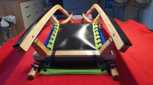

# Kunststoffschienen
{: .no_toc }
### Preis: 59€

* Die Kunststoffschienen sind in schwarz und grün erhältlich. 
* Geeignet für 120 cm und 115 cm Rodeln.
* Passend für Torggler (z.B. TS 120), Gasser und alle anderen Hersteller.
* Abmaße: 1050 mm x 36mm x 10 mm. Auf Wunsch auch Überbreiten bzw. Sondermaße erhältlich. 

Die Kunststoffschienen laufen sehr schnell, auch bei Neuschnee. 
Die Befestigungsschraben und Muttern und Scheiben sind aus Edelstahl. 
Bei Verschleiß können die Schienen abgehobelt oder abgeschliffen werden.

{:target="_blank"}
