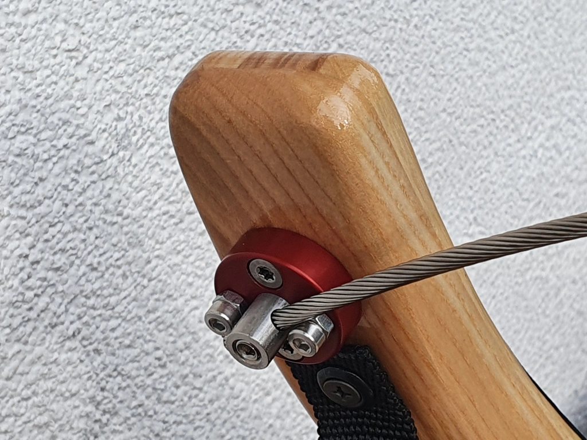

# Drehgelenk-Lenkseil
{: .no_toc }

Das Drehgelenk-Lenkseil ist aus hochwertigem (eloxierten) Aluminium und Edelstahl hergestellt. 
Alle Schrauben sind ebenso aus Edelstahl. 
Die Befestigung erfolgt ganz einfach durch zwei Holzschrauben. 
Erhältlich in rot, blau und schwarz. Auch kombinierbar auf Wunsch.

[]
